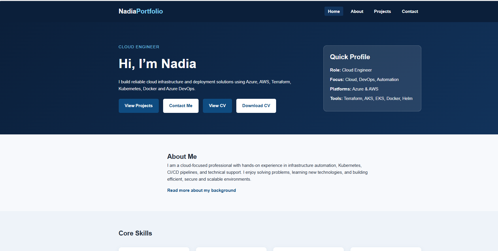
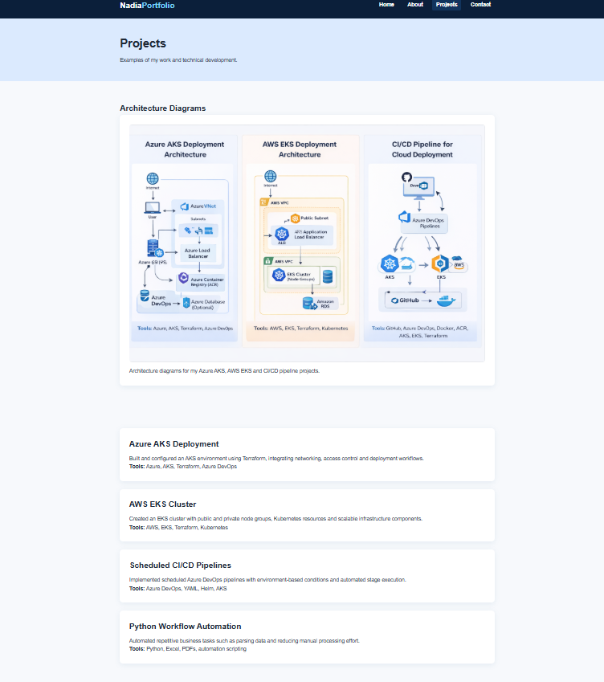
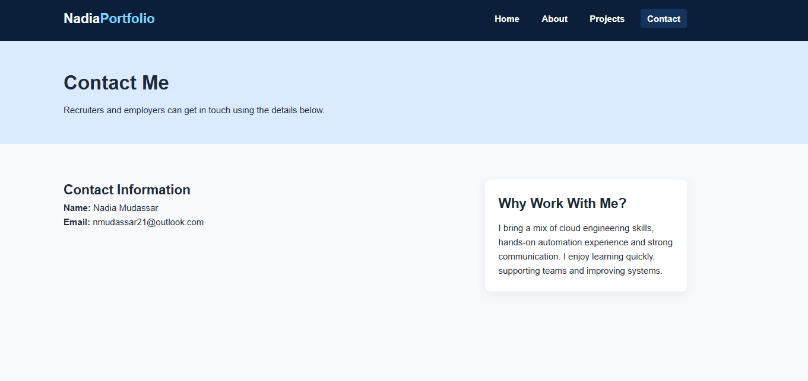
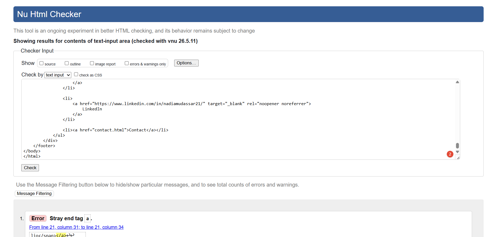
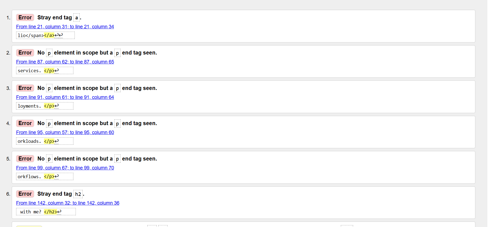
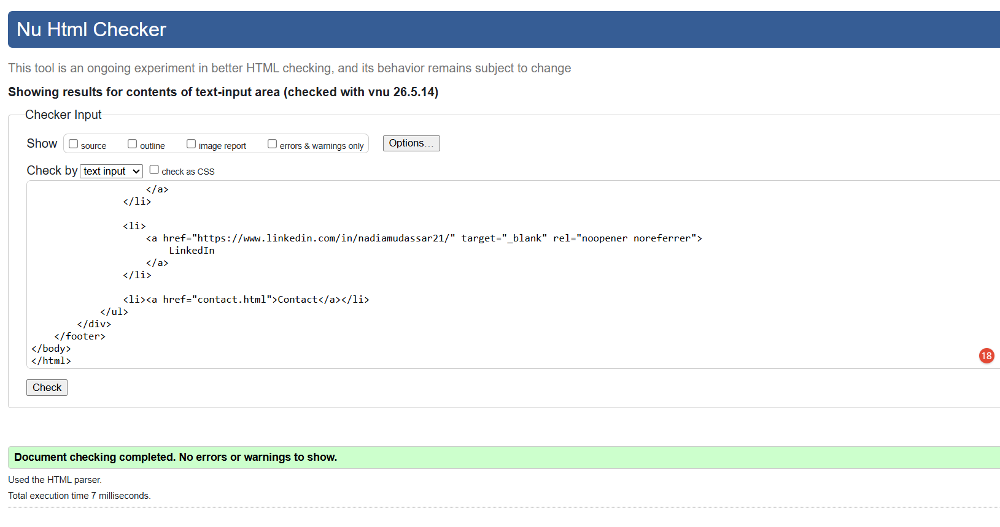
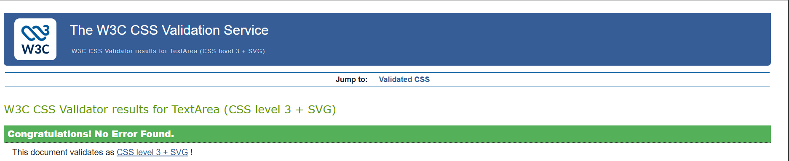

# portfolio
# Nadia Portfolio Website

## Project Overview

This project is a personal portfolio website created to present my background, technical skills, certifications, and project work in a clear, professional, and accessible way. The website is designed for recruiters, hiring managers, employers, and professional contacts who want to quickly understand my cloud engineering and DevOps experience.

The website is a static front-end application built using custom HTML5 and CSS3. It includes multiple pages, a consistent navigation menu, responsive layouts, professional content, external profile links, a downloadable CV, project cards, and architecture diagram evidence.

The project was also developed to meet the learning outcomes for Milestone 1: User-Centric Front-End Development, including UX design, accessibility, responsiveness, semantic HTML, CSS organisation, version control, testing, and deployment.

---

## Live Links

**Live Website:**
[https://nmudassar.github.io/portfolio/](https://nmudassar.github.io/portfolio/)

**GitHub Repository:**
[https://github.com/Nmudassar/portfolio](https://github.com/Nmudassar/portfolio)

---

# Project Aim

The aim of this project was to design, build, test, and deploy a professional portfolio website that demonstrates both front-end development skills and cloud/DevOps knowledge.

The project was created to:

* provide a professional online profile for recruiters and employers
* present technical skills, certifications, and project work in a structured way
* demonstrate HTML5 and CSS3 front-end development ability
* show understanding of accessibility, responsiveness, and user experience design
* provide links to GitHub, LinkedIn, and a downloadable CV
* show a clear development lifecycle using Git and GitHub commits

---

# Target Audience

The target audience for this website includes:

* recruiters looking for cloud or DevOps candidates
* hiring managers reviewing technical skills and project examples
* employers who want to access a CV and professional links quickly
* technical professionals who want to view GitHub activity and project evidence
* networking contacts who want to learn more about my background

The website is designed to make their journey simple, clear, and efficient.

---

# User Goals

Users should be able to:

* understand who I am and what type of role I am interested in
* view my technical skills and certifications
* explore my cloud, DevOps, and automation projects
* access GitHub and LinkedIn links easily
* download or view my CV
* navigate between pages without confusion
* use the website on desktop, tablet, and mobile devices

These user goals influenced the structure, navigation, content layout, and responsive design of the project.

---

# Site Owner Goals

As the site owner, my goals were to:

* create a professional online presence
* showcase my skills in cloud engineering, DevOps, automation, and technical support
* demonstrate front-end development skills using HTML and CSS
* make the site accessible and responsive
* provide a simple user journey from introduction to projects to contact details
* create a maintainable project structure that can be updated in the future

---

# User Stories

## Recruiter / Employer User Stories

**User Story 1:**
As a recruiter, I want to quickly understand the candidate’s background so that I can decide whether they are suitable for a role.

**How this is met:**
The homepage introduces my professional focus, key skills, and DevOps/cloud background clearly.

---

**User Story 2:**
As a hiring manager, I want to view the candidate’s projects so that I can assess practical technical experience.

**How this is met:**
The Projects page includes project cards covering Azure AKS, AWS EKS, CI/CD pipelines, and automation work.

---

**User Story 3:**
As an employer, I want to access the candidate’s CV easily so that I can review qualifications in more detail.

**How this is met:**
The homepage includes buttons to view and download the CV.

---

**User Story 4:**
As a recruiter, I want the portfolio to be easy to navigate so that I can find information quickly.

**How this is met:**
A consistent navigation menu appears across the site with links to Home, About, Projects, and Contact.

---

**User Story 5:**
As a visitor, I want links to GitHub and LinkedIn so that I can verify professional activity and connect externally.

**How this is met:**
GitHub and LinkedIn links are included in the footer and contact page.

---


## O1: Design a Front-End Web Application Based on UX, Accessibility and Responsivity

## 1.1 Website Design: Navigation Menu and Structured Layout

Before building the website, I planned a clear structure so users could move through the portfolio easily. The website uses a main navigation menu on every page with links to:

- Home
- About
- Projects
- Contact

This navigation supports the user story: “As a recruiter, I want the portfolio to be easy to navigate, so that I can find information quickly without confusion.”

### Planned Page Structure

Each page follows the same layout:

1. Header with logo/name and main navigation menu
2. Main content area with clear headings and sections
3. Footer with useful links and contact information

### Wireframe Plan

Home Page:
Header / Navigation  
Hero section introducing Nadia  
Call-to-action buttons  
Skills summary  
Footer  

About Page:
Header / Navigation  
About introduction  
Experience and certifications  
Skills section  
Footer  

Projects Page:
Header / Navigation  
Project cards  
GitHub/project links  
Footer  

Contact Page:
Header / Navigation  
Contact information  
GitHub and LinkedIn links  
Footer  

This structure was chosen to make the website simple, professional, and easy for recruiters and employers to use.

### 1.2 Accessibility Guidelines

Accessibility was considered through:

* semantic HTML elements
* skip link for keyboard users
* clear headings
* readable font sizes
* colour contrast between foreground and background
* alt text for images
* external links using `rel="noopener noreferrer"`

---

### 1.3 Organisation of Information

Information is organised using headings, sections, cards, and page-specific content. Each page has a clear purpose:

* Home introduces the portfolio
* About explains background and certifications
* Projects shows technical project work
* Contact provides ways to connect

---

### 1.4 Background and Foreground Contrast

The website uses plain background colours and strong foreground text contrast. Backgrounds do not distract from the main content.

---

### 1.5 Consistent Graphics

The architecture diagram and card layout follow the same professional theme and colour style as the rest of the site.

---

### 1.6 User-Initiated Actions

Users control actions such as:

* opening project links
* opening GitHub and LinkedIn links
* viewing the CV
* downloading the CV
* navigating to different pages

There are no automatic pop-ups, audio, or video elements that take control away from users.

---

### Merit: Clear Flow and Interaction Feedback

The website has a clear flow from introduction, to background, to projects, to contact. Buttons, links, and project cards provide hover feedback so users can identify interactive areas.

---

## O2: Develop and Implement a Static Front-End Web Application Using HTML and CSS

### 2.1 Multi-Page Website

The website includes four pages:

* `index.html`
* `about.html`
* `projects.html`
* `contact.html`

Each page has a clear purpose and matches the portfolio design.

---

### 2.2 CSS Validation

Custom CSS was written in `assets/css/style.css` and checked using the W3C CSS Jigsaw Validator.

---

### 2.3 HTML Validation

Each HTML page was tested using the W3C Nu HTML Checker. Validation errors and warnings were fixed during testing.

Final result: no errors or warnings.

---

### 2.4 Image Quality

The architecture diagram image is stored inside `assets/images/` and displayed responsively so it does not appear stretched or pixelated.

---

### 2.5 External Links Open in New Tab

External links use:

```html
 target="_blank" rel="noopener noreferrer"
```

This applies to GitHub and LinkedIn links.

---

### 2.6 Responsive Layout

Responsive design was implemented using:

* CSS Grid
* Flexbox
* media queries
* flexible image sizing
* responsive containers

The layout changes appropriately on desktop, tablet, and mobile screen sizes.

---

### 2.7 Semantic Markup

Semantic HTML elements were used, including:

* `<header>`
* `<nav>`
* `<main>`
* `<section>`
* `<article>`
* `<aside>`
* `<footer>`

---

### 2.8 Site-Specific Content

The website uses real content about my skills, certifications, cloud engineering background, and projects. No Lorem Ipsum placeholder text is used.

---

### 2.9 Clear Navigation

The navigation menu is consistent across all pages and helps users find resources intuitively.

---

## 3: Documentation, Code Structure and Organisation

### 3.1 README Purpose and Deployment

This README explains:

* project purpose
* user value
* user stories
* design process
* development process
* testing process
* deployment procedure

---

### 3.2 Screenshots Aligned to User Stories

Screenshots should be added to the README to show evidence of how each user story has been met.

Example screenshot links:



---


---


---


---

### 3.3 Attribution

All custom HTML and CSS was written for this project. Learning references are listed in the Attribution section.

---

### 3.4 Separation of Custom Code and External Sources

No CSS framework or external template was used. Custom code is separated into HTML files and one external CSS file.

---

### 3.5 Commented Code Sections

The CSS file is organised into clearly commented sections, such as:

* Base / Reset
* Utility Classes
* Accessibility
* Header / Navigation
* Hero Section
* Cards
* Projects
* Footer
* Responsive Design

---

### 3.6 External CSS File

CSS is stored in:

```text
assets/css/style.css
```

It is linked in the `<head>` of each HTML page.

---

### 3.7 Readable Code

Code uses consistent indentation, clear spacing, and descriptive class names.

---

### 3.8 File Naming

Files are named consistently using lowercase letters and no spaces.

Examples:

* `index.html`
* `about.html`
* `projects.html`
* `contact.html`
* `style.css`
* `nadia-mudassar-cv.pdf`

---

### 3.9 Directory Structure

Files are grouped by type:

```text
portfolio-project/
│
├── index.html
├── about.html
├── projects.html
├── contact.html
├── README.md
│
└── assets/
    ├── css/
    │   └── style.css
    ├── images/
    │   └── architecture-diagrams.png
    └── docs/
        └── nadia-mudassar-cv.pdf
```

---

##  Version Control

### 4.1 Git and GitHub

Git and GitHub were used to track development and host the project repository.

---

### 4.2 Descriptive Commit Messages

The development process was documented through descriptive commit messages.

Example commits include:

```text
Created index.html with basic HTML structure
Added header and navigation menu
Added hero section to homepage
Added About page structure
Added Projects page with project cards
Added Contact page content
Styled navigation and footer
Added responsive media queries
Fixed HTML validation errors
Updated README with testing evidence
```

---

### Merit: Small and Frequent Commits

The project was developed using smaller commits for each feature or fix. This makes the development process easier to follow and shows clear progress.

---

## O5: Testing and Deployment

### 5.1 Manual Testing Procedures

Manual testing was carried out to check functionality, usability, responsiveness, and validation.

| Test Area          | Expected Result                        | Actual Result        | Status |
| ------------------ | -------------------------------------- | -------------------- | ------ |
| Navigation links   | All page links open correctly          | Links work correctly | PASS   |
| GitHub links       | Open GitHub in new tab                 | Opens correctly      | PASS   |
| LinkedIn links     | Open LinkedIn in new tab               | Opens correctly      | PASS   |
| CV view link       | Opens CV file                          | Works correctly      | PASS   |
| CV download link   | Downloads CV file                      | Works correctly      | PASS   |
| Architecture image | Image displays correctly               | Works correctly      | PASS   |
| Responsive layout  | Layout adapts on mobile/tablet/desktop | Works correctly      | PASS   |
| HTML validation    | No errors or warnings                  | Passed after fixes   | PASS   |
| CSS validation     | No CSS issues                          | Passed               | PASS   |

---

### 5.2 Testing Documentation

Testing results, validation issues, bug fixes, and final outcomes are documented in this README.

---

### 5.3 Deployment

The final version was deployed using GitHub Pages and tested to confirm that the live version matches the development version.

---

### 5.4 Commented-Out Code Removed

Unnecessary commented-out code was removed before deployment.

---

### 5.5 No Broken Internal Links

Internal links were checked to confirm that Home, About, Projects, and Contact pages all open correctly.

---

# Wireframes and Layout Planning

Wireframes were created before development to demonstrate the planned structure of the website.

## Homepage Wireframe

```text
---------------------------------
| Logo | Navigation Menu        |
---------------------------------
| Hero Section                  |
| Introduction                  |
| Buttons / Call To Action      |
---------------------------------
| Skills / Summary Cards        |
---------------------------------
| Featured Projects             |
---------------------------------
| Footer                        |
---------------------------------
```

## About Page Wireframe

```text
---------------------------------
| Header / Navigation           |
---------------------------------
| About Banner                  |
---------------------------------
| Professional Summary          |
| Highlights Sidebar            |
---------------------------------
| Certifications Cards          |
---------------------------------
| Work Experience Timeline      |
---------------------------------
| Footer                        |
---------------------------------
```

## Projects Page Wireframe

```text
---------------------------------
| Header / Navigation           |
---------------------------------
| Projects Banner               |
---------------------------------
| Architecture Diagram          |
---------------------------------
| Project Cards                 |
| GitHub Links                  |
---------------------------------
| More Work Coming Soon         |
---------------------------------
| Footer                        |
---------------------------------
```

## Contact Page Wireframe

```text
---------------------------------
| Header / Navigation           |
---------------------------------
| Contact Banner                |
---------------------------------
| Contact Information           |
| Why Work With Me Card         |
---------------------------------
| Footer                        |
---------------------------------
```

---

# Screenshot Folder Structure

Create the following folders inside your project:

```text
assets/
└── images/
    └── screenshots/
        ├── homepage.png
        ├── about-page.png
        ├── projects-page.png
        ├── contact-page.png
        ├── responsive-mobile.png
        ├── responsive-tablet.png
        ├── html-validation-pass.png
        ├── css-validation-pass.png
        ├── stray-anchor-error.png
        ├── paragraph-tag-error.png
        ├── section-heading-warning.png
        ├── unclosed-section-error.png
        └── final-html-validation-pass.png
```

These screenshots should be added into the `assets/images/screenshots/` folder so they can be displayed correctly inside the README file.

---

# Detailed Feature Explanations

## Homepage Features

### Hero Section

The hero section is the first content users see when opening the website. It was designed to immediately explain who I am, what area I work in, and what technologies I specialise in.

The hero section includes:

* professional role title
* short introduction
* technical focus
* call-to-action buttons
* quick profile summary

This section supports recruiters because it quickly communicates my cloud engineering and DevOps background without requiring users to search through multiple pages.

---

### Call-to-Action Buttons

The homepage contains buttons that allow users to:

* view projects
* contact me
* open my CV
* download my CV

The buttons were designed with strong colour contrast and hover effects so users can clearly identify interactive areas.

---

### Quick Profile Card

The profile card provides a short summary of:

* role
* cloud platforms
* technical focus
* core tools

This improves usability because visitors can quickly scan important information.

---

## About Page Features

### Professional Summary Section

The Professional Summary section explains my background in cloud engineering, infrastructure automation, DevOps, Kubernetes, and technical support.

This section was written using clear professional language to make the information easy to understand for technical and non-technical recruiters.

---

### Highlights Section

The Highlights section presents important achievements and certifications in a simple bullet-point format.

This includes:

* AWS certification
* CKA certification
* Terraform certification
* cloud platform experience
* communication and coordination skills

Using a card layout improves readability and separates key achievements from the main body content.

---

### Education and Certifications Cards

The Education and Certifications section uses responsive cards to organise qualifications into separate visual blocks.

Each card contains:

* certification or qualification title
* short explanation
* relevant skills or knowledge gained

The card layout helps users scan the information quickly.

---

### Work Experience Timeline

The timeline section was designed to display experience in a structured and readable way.

Each timeline item includes:

* role title
* project or experience type
* short explanation of responsibilities
* technologies and skills used

This layout improves information hierarchy and user experience.

---

## Projects Page Features

### Architecture Diagram Section

The Projects page contains an architecture diagram image to visually support the technical project explanations.

The image demonstrates:

* Azure AKS infrastructure
* AWS EKS infrastructure
* CI/CD pipeline workflows
* deployment structure concepts

The image is responsive and scales correctly across screen sizes.

---

### Project Cards

Each project is displayed using a reusable card layout.

Each project card contains:

* project title
* short project description
* technologies used
* GitHub project link

Hover effects were added to improve interactivity and user feedback.

---

### GitHub Integration

All project cards link to GitHub repositories.

External links open in a new tab using:

```html
target="_blank" rel="noopener noreferrer"
```

This improves security and user experience.

---

## Contact Page Features

### Contact Information Section

The Contact page contains:

* full name
* email address
* LinkedIn profile
* GitHub profile
* availability information

This allows recruiters and employers to connect easily.

---

### Why Work With Me Card

The contact page also contains a professional summary card explaining:

* cloud engineering experience
* automation knowledge
* communication skills
* willingness to learn and collaborate

This supports the website goal of presenting a professional profile.

---

# Detailed Explanation of Bullet Points for README

## User Goals

### Understand who I am and what I do

The website was designed to immediately introduce me as a Cloud Engineer and DevOps-focused professional. The homepage includes a professional introduction, technical focus, and summary of my experience so visitors can quickly understand my background and career direction without needing to search through multiple pages.

### View my technical background and certifications

The About page was created to provide detailed information about my qualifications, certifications, and technical knowledge. This includes AWS, Kubernetes, and Terraform certifications along with explanations of the technologies and platforms I have worked with. The information is organised into sections and cards so it is easy to read and understand.

### Explore my project work

The Projects page was developed to showcase practical examples of my work in cloud infrastructure, automation, Kubernetes, and CI/CD pipelines. Each project includes a short description, technologies used, and GitHub links so users can review my work in more detail.

### Access my GitHub profile

GitHub links are included throughout the website to allow recruiters and employers to review repositories, code structure, and development projects. External links open in new tabs to improve usability and maintain the user’s position on the portfolio website.

### Connect with me through LinkedIn

The Contact page includes a LinkedIn profile link so professional contacts and recruiters can connect directly. This improves networking opportunities and provides another method for employers to review professional experience and activity.

### Download my CV easily 

The homepage contains both “View CV” and “Download CV” buttons. These options were included to improve usability by allowing visitors either to preview the CV in the browser or save it directly to their device.

---

# Site Owner Goals

### Build a professional online presence

The project was designed to create a professional and modern digital presence that reflects my skills, experience, and career interests. The design focuses on clean layouts, clear typography, and structured content to create a strong first impression.

### Present my experience in a clear and structured format

Information was organised into sections, cards, timelines, and responsive layouts to ensure that users can quickly find relevant information. Headings and spacing were used to improve readability and information hierarchy.

### Demonstrate front-end development ability

The project was built using semantic HTML5 and custom CSS3 without relying on frameworks. This demonstrates understanding of responsive design, accessibility, layout structure, styling, and deployment workflows.

### Showcase cloud and DevOps knowledge

The project includes references to Azure, AWS, Terraform, Kubernetes, Docker, Helm, and Azure DevOps. Project cards and architecture diagrams were added to demonstrate technical knowledge and practical experience.

### Make it easy for employers to contact me

The Contact page was created to provide clear communication channels including email, LinkedIn, GitHub, and availability status. This ensures recruiters can easily connect with me for opportunities or discussions.

---

# Must-Have Features

### Clear and responsive navigation menu

The navigation menu appears consistently across all pages and allows users to move through the website easily. Media queries were used to ensure the navigation adapts correctly on smaller screen sizes.

### Homepage introducing the portfolio owner

The homepage contains a hero section introducing my role, technical focus, and career interests. It also includes call-to-action buttons and a quick profile card.

### About page with background and certifications

The About page provides more detailed professional information including certifications, work experience, technical strengths, and education.

### Projects page showing technical work

The Projects page contains project cards, architecture diagrams, and descriptions of cloud and DevOps projects. This allows users to explore practical examples of my work.

### Contact page with external links

The Contact page provides professional contact information and external links to GitHub and LinkedIn.

### Downloadable CV

A downloadable CV feature was included to improve accessibility for recruiters and employers.

### Responsive styling for different screen sizes

The project uses CSS Grid, Flexbox, percentage-based widths, and media queries to maintain layout structure across mobile, tablet, and desktop devices.

---

# UX Design Principles Applied

### Information Hierarchy

The website uses headings, spacing, section layouts, and card components to prioritise important information. Users can quickly identify projects, certifications, contact information, and navigation areas.

### Consistency

Colours, spacing, buttons, typography, and navigation styles remain consistent across all pages. This improves usability and reduces confusion for users.

### User Control

Users are able to choose what they want to explore through navigation links, buttons, project cards, GitHub links, and downloadable documents.

### Accessibility

Accessibility features include:

* semantic HTML structure
* skip links for keyboard navigation
* descriptive alt text
* strong colour contrast
* readable font sizes
* responsive layouts

These features improve usability for a wider range of users.

### Feedback

Hover effects were added to buttons, links, and project cards to provide visual interaction feedback and improve the user experience.

---

# Testing Explanations

### Navigation Testing

Every navigation link was tested manually to confirm that pages open correctly and no broken internal links exist.

### Responsive Testing

The website was tested using browser developer tools across:

* mobile devices
* tablet layouts
* desktop resolutions

This confirmed that layouts adapt correctly without breaking content structure.

### HTML Validation

All HTML pages were tested using the W3C Nu HTML Checker to ensure semantic correctness and remove validation errors.

### CSS Validation

The CSS stylesheet was tested using the W3C Jigsaw Validator to ensure that all custom CSS passed validation successfully.

### External Link Testing

GitHub, LinkedIn, and CV links were tested to confirm they open correctly and external links use secure attributes.

### Bug Fixing

Several issues were discovered during development, including:

* unclosed section tags
* missing headings
* incorrect file paths
* HTML validation warnings
* layout issues on smaller screens

These were resolved through validation testing, code restructuring, and responsive CSS improvements.

---

# Screenshots and Evidence

Add your screenshots using this format after uploading them to your repository:

## Homepage Screenshot


**User story supported:**
As a recruiter, I want to quickly understand the candidate’s background.

**Explanation:**
The homepage introduces my role, skills, and professional focus clearly.

---

## Projects Page Screenshot


**User story supported:**
As a hiring manager, I want to review technical projects.

**Explanation:**
The Projects page shows cloud, DevOps, and automation work in a structured format.

---

## Contact Page Screenshot


**User story supported:**
As an employer, I want to contact the candidate easily.

**Explanation:**
The Contact page provides direct professional contact information and links.

---

## HTML Validation Screenshot


**Explanation:**
The W3C Nu HTML Checker confirmed that the final HTML had no errors or warnings.

---

# Validation Errors, Solutions and Evidence

## Error 1: Stray End Tag `a`

**Screenshot evidence:**





**Problem:**
The validator reported a stray closing `</a>` tag.

**Cause:**
An anchor tag had been closed incorrectly in the navigation area.

**Solution:**
The navigation structure was reviewed and corrected so every opening `<a>` tag had one matching closing `</a>` tag.

**Result:**
The stray anchor tag error was fixed.

---

## Error 2: Incorrect Paragraph Closing Tag

**Screenshot evidence:**


**Problem:**
The validator reported paragraph closing tag issues.

**Cause:**
Some paragraph tags were not correctly nested or had extra closing `</p>` tags.

**Solution:**
Each paragraph was checked and corrected so every `<p>` tag opened and closed properly.

**Result:**
The paragraph validation errors were removed.

---

## Error 3: Section Lacks Heading

**Screenshot evidence:**


**Problem:**
The validator warned that a `<section>` element did not contain a heading.

**Cause:**
Some `<section>` elements were being used only for layout purposes.

**Solution:**
Where the section was only used for layout, it was replaced with a `<div>`. Where a real content section existed, a heading was added.

**Result:**
The warning was removed and the semantic structure improved.

---

## Error 4: Unclosed Section Element

**Screenshot evidence:**





**Problem:**
The validator reported an unclosed `<section>` element and an end tag error for `<main>`.

**Cause:**
An extra opening `<section class="section section-alt">` was added in the Projects page and not closed correctly.

**Solution:**
The extra unclosed `<section>` line was removed and the layout wrapper was changed to a correctly closed `<div>`.

**Result:**
The unclosed section and main end tag errors were fixed.

---

## Final HTML Validation Result

**Screenshot evidence:**




After all fixes, the W3C Nu HTML Checker showed:

> Document checking completed. No errors or warnings to show.

This confirms that the HTML code now passes validation successfully.

---

# CSS Validation

The CSS file was checked using the W3C CSS Jigsaw Validator.

**Screenshot evidence:**





The CSS was organised into clear sections and written in an external stylesheet.

---

# Manual Testing

| Page / Feature    | Test Performed               | Expected Result         | Actual Result    | Status |
| ----------------- | ---------------------------- | ----------------------- | ---------------- | ------ |
| Home page         | Open `index.html`            | Page loads correctly    | Loaded correctly | PASS   |
| About page        | Open `about.html`            | Page loads correctly    | Loaded correctly | PASS   |
| Projects page     | Open `projects.html`         | Page loads correctly    | Loaded correctly | PASS   |
| Contact page      | Open `contact.html`          | Page loads correctly    | Loaded correctly | PASS   |
| Navigation        | Click each nav link          | Correct page opens      | Worked correctly | PASS   |
| GitHub link       | Click external GitHub link   | Opens in new tab        | Worked correctly | PASS   |
| LinkedIn link     | Click external LinkedIn link | Opens in new tab        | Worked correctly | PASS   |
| CV view           | Click View CV                | CV opens                | Worked correctly | PASS   |
| CV download       | Click Download CV            | CV downloads            | Worked correctly | PASS   |
| Responsive design | Test mobile width            | Layout stacks correctly | Worked correctly | PASS   |
| Image display     | Check architecture image     | Image appears clearly   | Worked correctly | PASS   |

---

# Responsive Testing

The site was tested using browser developer tools on:

* mobile screen sizes
* tablet screen sizes
* desktop screen sizes

Responsive behaviour confirmed:

* navigation adjusts on smaller screens
* cards stack into single columns on mobile
* images remain inside containers
* text remains readable
* layout does not overflow horizontally

---

# Deployment

The website was deployed using GitHub Pages.

## Deployment Steps

1. Created a GitHub repository.
2. Added project files locally.
3. Used Git to commit the project files.
4. Pushed the project to GitHub.
5. Opened repository settings.
6. Enabled GitHub Pages.
7. Selected the `main` branch and root folder.
8. Tested the live website link.

---

# Running Locally

To run the project locally:

1. Clone the repository.
2. Open the project folder in VS Code.
3. Open `index.html` with Live Server or a browser.

---

# Technologies Used

* HTML5
* CSS3
* Git
* GitHub
* GitHub Pages
* VS Code
* Chrome DevTools
* W3C Nu HTML Checker
* W3C CSS Jigsaw Validator

---

# Attribution

All custom HTML and CSS code was written for this project.

Resources used for learning and reference:

* MDN Web Docs
* W3Schools
* GitHub Documentation
* W3C HTML Validator
* W3C CSS Validator

No external CSS frameworks or templates were used.

---

# Future Improvements

Future improvements could include:

* JavaScript interactivity
* contact form validation
* dark mode toggle
* animation effects
* individual project detail pages
* more project screenshots
* improved downloadable resources

---

# Reflection

This project helped me improve my understanding of HTML structure, CSS styling, responsive design, accessibility, validation, Git workflows, and deployment using GitHub Pages.

It also helped me understand why planning, wireframes, small commits, testing evidence, and validation are important parts of a professional development lifecycle.

---

# Conclusion

This portfolio website successfully presents my cloud engineering and DevOps background in a structured, accessible, and responsive way.

The project meets the purpose of creating a professional online portfolio and demonstrates front-end development skills through custom HTML, CSS, organised code, validation, testing, and deployment.

---

# Author

Nadia Mudassar
Junior Cloud Engineer

GitHub: [https://github.com/Nmudassar](https://github.com/Nmudassar)
LinkedIn: [https://www.linkedin.com/in/nadiamudassar21/](https://www.linkedin.com/in/nadiamudassar21/)

---

# License

This project is for educational and portfolio purposes.
